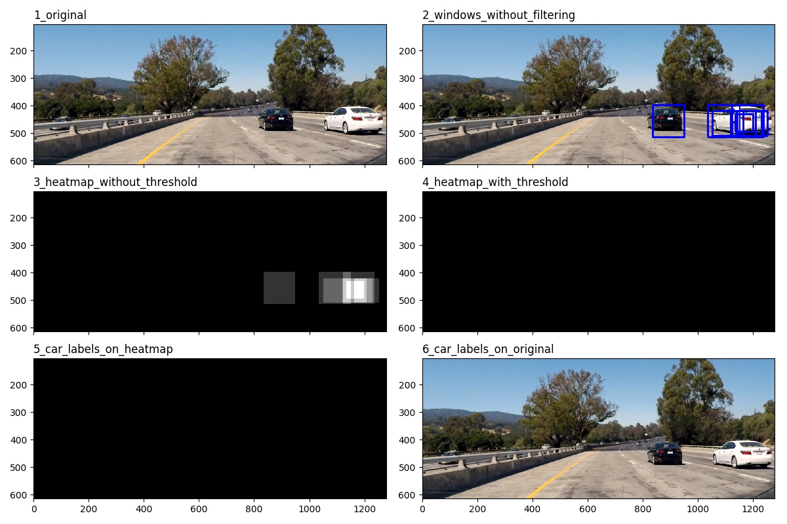
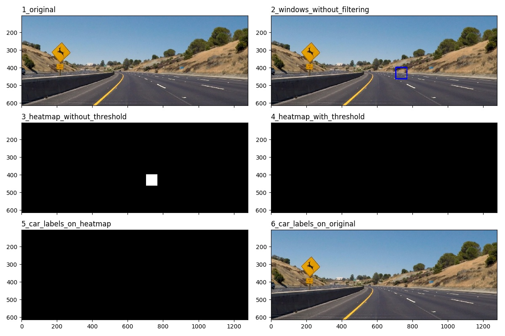
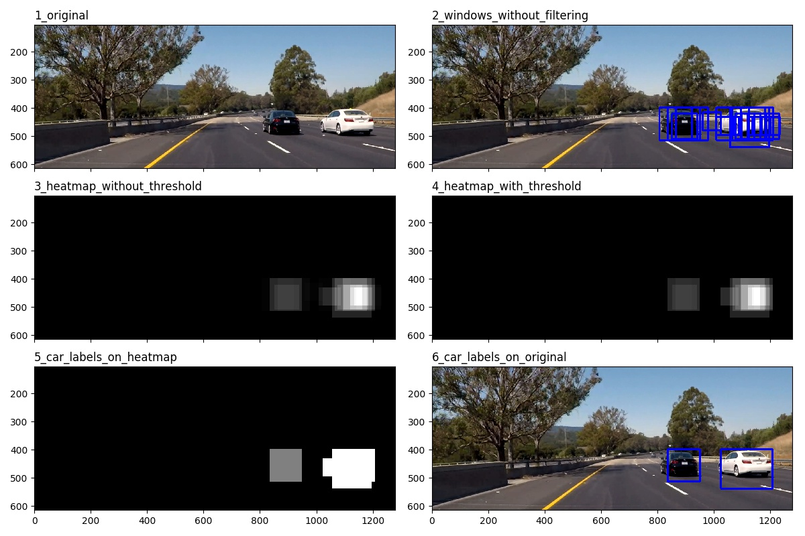
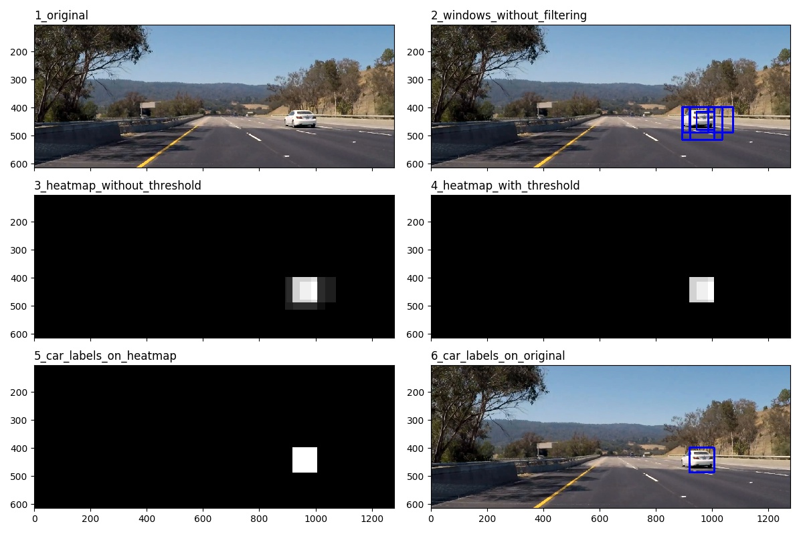

##Writeup Template
###You can use this file as a template for your writeup if you want to submit it as a markdown file, but feel free to use some other method and submit a pdf if you prefer.

---

**Vehicle Detection Project**

The goals / steps of this project are the following:

* Perform a Histogram of Oriented Gradients (HOG) feature extraction on a labeled training set of images and train a classifier Linear SVM classifier
* Optionally, you can also apply a color transform and append binned color features, as well as histograms of color, to your HOG feature vector.
* Note: for those first two steps don't forget to normalize your features and randomize a selection for training and testing.
* Implement a sliding-window technique and use your trained classifier to search for vehicles in images.
* Run your pipeline on a video stream (start with the test_video.mp4 and later implement on full project_video.mp4) and create a heat map of recurring detections frame by frame to reject outliers and follow detected vehicles.
* Estimate a bounding box for vehicles detected.


## [Rubric](https://review.udacity.com/#!/rubrics/513/view) Points
###Here I will consider the rubric points individually and describe how I addressed each point in my implementation.  

---
###Writeup / README

####1. Provide a Writeup / README that includes all the rubric points and how you addressed each one.  You can submit your writeup as markdown or pdf.  [Here](https://github.com/udacity/CarND-Vehicle-Detection/blob/master/writeup_template.md) is a template writeup for this project you can use as a guide and a starting point.  

You're reading it!

###Histogram of Oriented Gradients (HOG)

####1. Explain how (and identify where in your code) you extracted HOG features from the training images.

All the feature extraction are performed inside the Extractor object (`extractor.py`).

- Spatial Binning
- Color Histogram
- Histogram of Orientation

For HOG extraction, I use sklearn's hog feature. The hyper-parameters are stored as class variables for easy tuning. I converted to the `YCrCb` color-space since that produced higher accuracy.

These features are flattened and scaled before training. The scaler is stored in the Extractor object so that it could be applied during prediction phase.

```python
def _extract_hog_one_channel(self, x, visualise = False, feature_vec = True):
    result = hog(x, orientations = self.ORIENT, pixels_per_cell = self.PIX_PER_CELL, cells_per_block = self.CELL_PER_BLOCK, visualise = visualise, feature_vector = feature_vec, transform_sqrt=False, block_norm ='L1')

    if visualise:
        hog_feature, hog_image = result
    else:
        hog_feature = result
        hog_image = None
    return hog_feature, hog_image

def _extract_hog(self, x_converted, visualise = False, feature_vec = True, channel = None):
    if channel:
        x_feature_hog, x_image_hog = self._extract_hog_one_channel(x_converted[:,:,channel], visualise = visualise, feature_vec = feature_vec)
    else:
        x_feature_hog = []
        x_image_hog = []
        for channel in range(x_converted.shape[2]):
            feature_hog, image_hog = self._extract_hog_one_channel(x_converted[:,:,channel], visualise = visualise, feature_vec = feature_vec)
            x_feature_hog.append(feature_hog)
            x_image_hog.append(image_hog)

    if visualise:
        return np.array(x_feature_hog), x_image_hog
    else:
        return np.array(x_feature_hog), None
```  

####2. Explain how you settled on your final choice of HOG parameters.

I tried various combinations of parameters by tuning the class variables set in `extractor.py` and chose to go with the default parameters since that gave me the best classification accuracy. If speed is an important consideration, I would choose to go with a bigger spatial size, orient and block size to improve performance.

```python
  # BIN SPATIAL
  SPATIAL_SIZE = (32, 32)
  COLOR_SPACE = 'YCrCb'

  # COLOR HISTOGRAM
  NBINS = 32
  BINS_RANGE = (0, 256)

  # HOG
  ORIENT = 9
  PIX_PER_CELL = (8, 8)
  CELL_PER_BLOCK = (2,2)
```

####3. Describe how (and identify where in your code) you trained a classifier using your selected HOG features (and color features if you used them).

The data are extracted and divided into train, validation, test sets in `etl.py`. I choose to put all the GTI data into the training test to avoid polluting the validation and test set with time-series data. The breakdown is as follows:

```
the training data consists of:
- all the GTI vehicle data (2826 pictures)
- 55% of the KITTI vehicle data (3281 pictures)
- 70% of the non-vehicles data (6277 pictures)

the validation data consists of:
- 30% of the KITTI vehicle data (1790 pictures)
- 20% of the non-vehicle data (1793 pictures)

the test data consists of:
- 15% of the KITTI vehicle data (895 pictures)
- 10% of the non-vehicle data (897 pictures)
```

After that, I trained a linear SVM using spatial binning, color histogram and HOG features. The training is handled by the Trainer class located in `trainer.py`, which calls the Extractor class `extractor.py` methods to perform feature extraction. The final model is saved in a pickle file for ongoing access.

 The accuracy results are:

- Train:
- Test:

I used a CalibratedClassifierCV wrapper for the LinearSVC class in order to produce a probability prediction which becomes useful for eliminating false positives.

```python
def _train_svm(self, data):
    X_train, y_train, X_valid, y_valid, X_test, y_test = data

    model = LinearSVC()
    calibrated_svc = CalibratedClassifierCV(model, cv=3)

    calibrated_svc.fit(X_train, y_train)
    return calibrated_svc

def train(self):
    if self.verbose:
        print('Extracting features')

    prep_data = self._prep_data(self.data)
    X_train, y_train, X_valid, y_valid, X_test, y_test = prep_data

    if self.verbose:
        print('Training SVM')

    svm_model = self._train_svm(prep_data)

    svm_train_score = svm_model.score(X_train, y_train)
    svm_valid_score = svm_model.score(X_valid, y_valid)

    if self.verbose:
        print('Train score: ', svm_train_score)
        print('Valid score: ', svm_valid_score)

    self.best_model = svm_model

    return self.best_model
```


###Sliding Window Search

####1. Describe how (and identify where in your code) you implemented a sliding window search.  How did you decide what scales to search and how much to overlap windows?

I implemented a sliding window search with hog sub-sampling. This search is performed by the Searcher class in `searcher.py`.

```python
def search(self, img):
    car_windows = []

    for scale in self.SCALES:
        car_windows.extend(self._search_by_hog_subsampling_one(img, scale))

    return car_windows
```

The HOG features are generated once per scale and sub-sampled during the search to improve performance. It was taking upward of 12-15 seconds to process a single frame by generating HOG features per window. With sub-sampling, the lead time decreases to 1.7s per frame.

Through trials and errors, I found that the five scales from [1, 1.4, 1.8, 2.2, 2.5] with a heat-map threshold of 7 for a 10-frame window produce the best results. Given more time and if performance is a big concern, I would limit the number of scales to 3 with bigger step size.

Since the classifier produces pretty good training and validation results, I leveraged probability prediction during the prediction phase. A prediction must produce a probability higher than .90 in order to be classified as car. Using this, most false positives are discarded even without multiple frame averaging.

The downside is that a high threshold might result in more false negatives, but frame averaging makes it very unlikely that a true positive is missed repeatedly, unless there is a fundamental problem with the classifier itself.

```python
# Scale features and make a prediction
test_features = extractor.scale([features])
predict_proba = self.model.predict_proba(test_features)[0]
# test_prediction = self.model.predict(test_features)[0]

# if test_prediction:
if predict_proba[1] > self.PREDICT_PROBA_THRESHOLD:
    # import ipdb; ipdb.set_trace()
    xbox_left = np.int(xleft * scale)
    ytop_draw = np.int(ytop * scale)
    win_draw = np.int(window * scale)

    car_windows.append(((ytop_draw+ystart, xbox_left), (ytop_draw+win_draw+ystart, xbox_left+win_draw)))
```

####2. Show some examples of test images to demonstrate how your pipeline is working.  What did you do to optimize the performance of your classifier?

Ultimately I searched on two scales using YCrCb 3-channel HOG features plus spatially binned color and histograms of color in the feature vector, which provided a nice result.  Here are example images of the classification. You can immediately see that with such a high thresholding, we have few false positives to start with.

(Ignore image 4-6 in each plot because frame averaging obviously does not work on single frames)

Image 1:



Image 2:



### Video Implementation

####1. Provide a link to your final video output.  Your pipeline should perform reasonably well on the entire project video (somewhat wobbly or unstable bounding boxes are ok as long as you are identifying the vehicles most of the time with minimal false positives.)
Here's a [link to my video result](project_video_output.mp4)


####2. Describe how (and identify where in your code) you implemented some kind of filter for false positives and some method for combining overlapping bounding boxes.

Filtering is done by the Tracker class in `tracker.py`. The tracker keeps tracks of the coordinates of windows where a car has been identified for the last 10 frames.


I recorded the positions of positive detections in each frame of the video.  From the positive detections I created a heatmap and then thresholded that map to identify vehicle positions.  I then used `scipy.ndimage.measurements.label()` to identify individual blobs in the heatmap.  I then assumed each blob corresponded to a vehicle.  I constructed bounding boxes to cover the area of each blob detected.  

```python
def track(self, write_images = False):
      img = self.current_img

      heatmap_no_thresh = self._add_heat_to_heatmap(img, self.windows)
      heatmap_thresh = self._apply_threshold_on_heatmap(heatmap_no_thresh, self.N_FRAME_HEATMAP_THRESHOLD)
      labels = label(heatmap_thresh)
      labeled_bboxes = self._find_labeled_bboxes(labels)
      final_result = self._draw_boxes(img, labeled_bboxes)

      if write_images:
          imgd = OrderedDict()

          imgd['windows_without_filtering'] = self._draw_boxes(img, self.windows)
          imgd['heatmap_without_threshold'] = heatmap_no_thresh
          imgd['heatmap_with_threshold'] = heatmap_thresh
          imgd['car_labels_on_heatmap'] = labels[0]
          imgd['car_labels_on_original'] = final_result
      else:
          imgd = None

      return final_result, imgd
```

Here's an example result showing the heatmap from a series of frames of video, the result of `scipy.ndimage.measurements.label()` and the bounding boxes then overlaid on the last frame of video:

Image 1:



Image 2:



---

###Discussion

####1. Briefly discuss any problems / issues you faced in your implementation of this project.  Where will your pipeline likely fail?  What could you do to make it more robust?

Here is the final pipeline:
- Data extraction: etl.py
- Feature extraction: extrator.py
- Training: trainer.py
- Single frame searching: searcher.py
- Frame averaging: tracker.py

There are a few concerns I have:
- Thresholding: as a common theme throughout this project, we are tuning the hyperparameters manually to a small number of examples. This likely does not scale to real world situation. I would like to learn how parameter tuning is done in production autonomous vehicles.
- Speed: it takes nearly 1.7s to process a single frame, which is unacceptable in real world condition.

I think a deep-learning approach might potentially address these issues and I look forward to trying again in Term 3.
